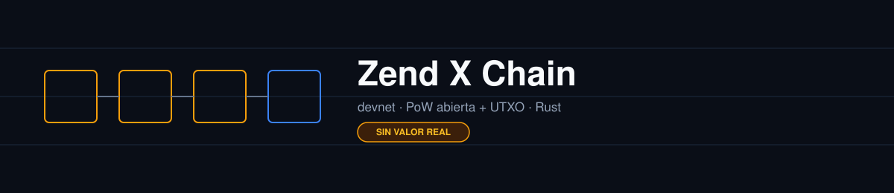
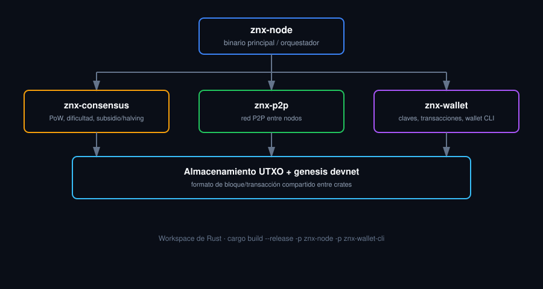

<p align="center">
  
</p>

<p align="center">
  
  
  
  
  
</p>

# Zend X Chain — devnet

Código fuente de la capa de consenso, la red P2P y la wallet de **Zend X Chain**, la blockchain propia (PoW abierta + UTXO) detrás de ZNX. Este repo es un espejo público de la carpeta `blockchain/` del monorepo interno de ZendX — el resto de la plataforma permanece privado.

> [!IMPORTANT]
> **Esto es la devnet**: sin premine, sin fondos con valor real, dificultad ajustada para poder minar con hardware normal. El objetivo es técnico y comunitario — auditar el código de consenso y correr un nodo real. La mainnet (con sus propios parámetros, todavía en preparación) será una red separada.

## Tabla de contenidos

- [Documentación técnica](#documentación-técnica)
- [Arquitectura](#arquitectura)
- [Estructura del repositorio](#estructura-del-repositorio)
- [Build local](#build-local)
- [Correr con Docker](#correr-con-docker)
- [Cómo contribuir / auditar](#cómo-contribuir--auditar)
- [Preguntas frecuentes](#preguntas-frecuentes)
- [Licencia](#licencia)
- [Autor](#autor)

## Documentación técnica

| Documento | Contenido |
|---|---|
| [`docs/MINING.md`](docs/MINING.md) | Cómo correr tu propio nodo y minar |
| [`docs/ARCHITECTURE.md`](docs/ARCHITECTURE.md) | Diseño técnico: crates, formato de bloque/transacción, storage |
| [`docs/CONSENSUS.md`](docs/CONSENSUS.md) | Reglas de consenso: PoW, ajuste de dificultad, subsidio/halving |

## Arquitectura

<p align="center">
  
</p>

Ver el detalle completo en [`docs/ARCHITECTURE.md`](docs/ARCHITECTURE.md).

## Estructura del repositorio

```
crates/       - workspace de Rust (znx-node, znx-consensus, znx-p2p, znx-wallet, ...)
genesis/      - archivo de génesis de la devnet
docs/         - documentación técnica
Dockerfile    - imagen para correr un nodo sin compilar
```

## Build local

Requiere el toolchain de Rust (`cargo`, edición estable).

```bash
cargo build --release -p znx-node -p znx-wallet-cli
```

## Correr con Docker

Si preferís no compilar localmente, usá la imagen incluida:

```bash
docker build -t zendx-chain .
docker run -it zendx-chain
```

## Cómo contribuir / auditar

Este repo es, ante todo, un espejo público pensado para que operadores de nodo externos y auditores técnicos puedan revisar el código de consenso. Si encontrás un problema:

1. Abrí un issue describiendo el comportamiento observado vs. el esperado, con los pasos para reproducirlo.
2. Para cambios de código, hacé fork + PR contra `master`, explicando el motivo del cambio.
3. Para reportar una vulnerabilidad de consenso o seguridad, evitá publicarla como issue público — abrí un [Security Advisory](https://github.com/Nicolas-Pedernera/zendx-chain/security/advisories) en su lugar.

## Preguntas frecuentes

**¿Los ZNX de la devnet tienen valor?**
No. Es una red de pruebas explícitamente sin valor económico, pensada para testing y auditoría.

**¿Esto es la mainnet de ZendX?**
No. La mainnet es una red separada, con sus propios parámetros, todavía en preparación.

**¿Dónde está el resto de la plataforma ZendX (préstamos P2P, exchange, etc.)?**
Vive en el monorepo interno privado. Este repo solo espeja la carpeta `blockchain/`.

## Licencia

Ver [LICENSE](LICENSE).

## Autor

**Nicolás Pedernera**

Fundador & CEO de [ZendX](https://zendx.finance) — plataforma fintech con préstamos P2P, trading y exchange cripto.

- GitHub: [Nicolas-Pedernera](https://github.com/Nicolas-Pedernera)
- LinkedIn: [nicolas-pedernera-zendx](https://www.linkedin.com/in/nicolas-pedernera-zendx/)
